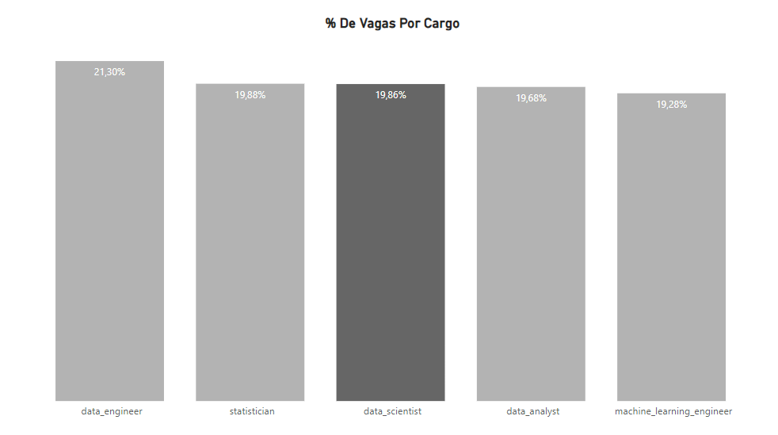
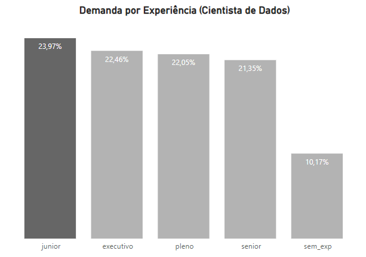
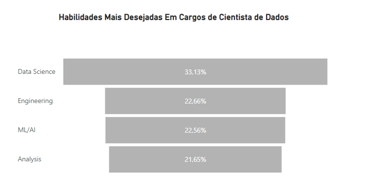
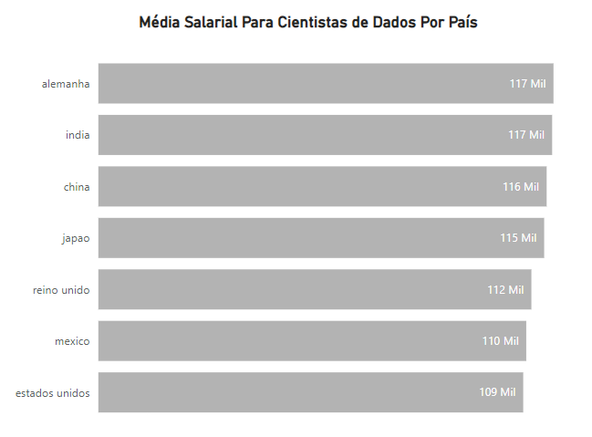
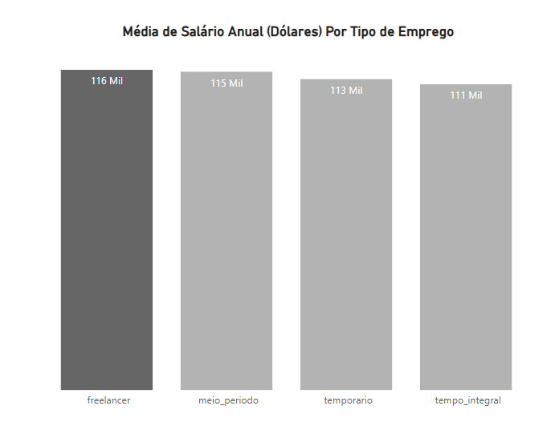

# Análise de Cargos Em Data Science

## Contexto
O mercado de Dados está em contante crescimento, é uma área relativamente nova e muitas muito requisitada por qualquer tipo de negócio. Com essa crescente na demanda de funcionários para o cargo, muitas pessoas acabaram migrando para área de dados seduzidos pela sua grante quantidade de benefícios.

Este projeto visa analisar dados e possiveis tendências para vagas de trabalho em Ciência de Dados.

## Sobre o projeto
O projeto foi separado em duas etapas: 
- Limpeza e pré-processamento de dados ([aqui](code/EDA.ipynb)), utilizando Python.
- Vizualização utilizando Power BI

## Dados
 Os dados aqui utilizados foram fornecidos pelo [Kaggle](https://www.kaggle.com/datasets/brsahan/data-science-job) e contêm campos essenciais para a análise, como cargo, empresa, local da empresa, faixa salarial etc...

 Os dados aqui analisados são referente aos intervalo de anos entre 2020 e 2022

## Problema de negócio
Nosso objetivo com esta análise é comparar as vagas para ciêntista de dados com outros cargos e identificar os melhores padões para entrar na área.

## Resultado
Primeiramente vamos iniciar com uma visão geral da distribuição dos cargos do nosso projeto.
#### Visual 1

- Aqui podemos observar que para esta análise a maior parte das vagas estão concentradas para Engenheiro de Dados, já Cientista de Dados (o foco desta análise) apresenta cerca de quase 20% das vagas analisadas. A diferença entre os cargos não são tão significativos, mas é algo a ser mencionado.

### Analisando as vagas para Cientista de Dados
#### Visual 2

- 24% das vagas anunciadas são destinadas à proficionais da categoria junior, isso mostra que a barreira de entrada para oculpar os cargos não está tão alta, referente aos anos que estamos analisando. 
- O que pode fortalecer esta observação é o fato de 10% das vagas não exigir experiência (possivelmente destinadas à estagiários).

#### Visual 3

- O presencial ainda continua possuindo a maior quantidade de vagas para Cientistas de Dados.

Dentre as habilidades desejadas para um ciêntista de dados, segue o gráfico que mostra a porcentagem do nível de desejo das empresas para com essa vaga:
#### Visual 4

- No pódio está conhecimento em ciência de dados no geral (conceitos estatísticos, modelagem de dados, mensuração e escalabilidade de dados etc...)
- Em seguida Engenharia, possivelmente Engenharia de Atributos (Coleta e limpeza de dados, transformação de dados), a transformação de dados brutos para um estado mais adeuqado para a modelagem.
- Machine Learning e Inteligência Artificial, apesar de serem de suma importância não ultrapassam as duas habilidades acima.
- Análise em ultima posição, pois apesar um Ciêntista de Dados utilizar da análise em algumas situações, seu foco principal está concentrado em resolver perguntas específicas.
  
### Dentre as vagas analisadas, quais países estão recrutando mais Cientistas de Dados? E quais países pagam melhor?

#### Visual 5

#### Visual 6

- India se mostra um destaque, além de  ter a maior quantidade de vagas, possui uma das maiores médias de salário anual.
- Nos Estados Unidos também possui muitas vagas, porém ele surpreende ao ser o país com o menor pagamento em relação aos demais.
- A China dispões da menor porcentagem de vagas, entretanto demonstra ter a terceira maior média salarial.
- A Alemanha por sua vez empata com a India em termmos de salário anual.

### Como o nível de experiência impacta nos tipos de emprego?

#### Visual 7

#### Visual 8

- Freelancer tende a pagar mais, tendo como principais alvos Cientistas de Dados de nível pleno e executivos.
- Proficionais de meio período também são bastante requisitados, principalmente juniors e plenos.
- Para os cargos temporários as vagas para junior tem mais abrangência.
- A segunda melhor oportunidade para juniors são empregos com tempo integral, e existe uma menor demanda para seniors também.

# Autor
Olá! Meu nome é Diego Armando Teles de Carvalho, sou cientista de dados, apaixonado por ciência de dados e business inteligence. Confira meu perfil no [Linkedin](https://www.linkedin.com/in/diegoarmandods/) e meus outros trabalhos no [GitHub](https://github.com/DieGod-DS).
